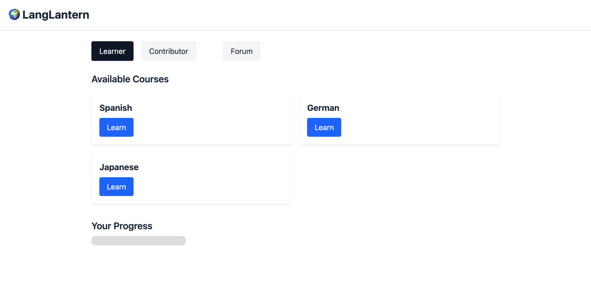
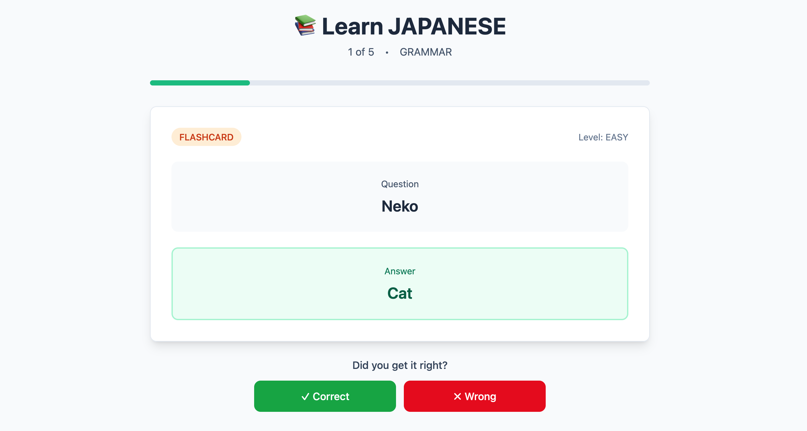
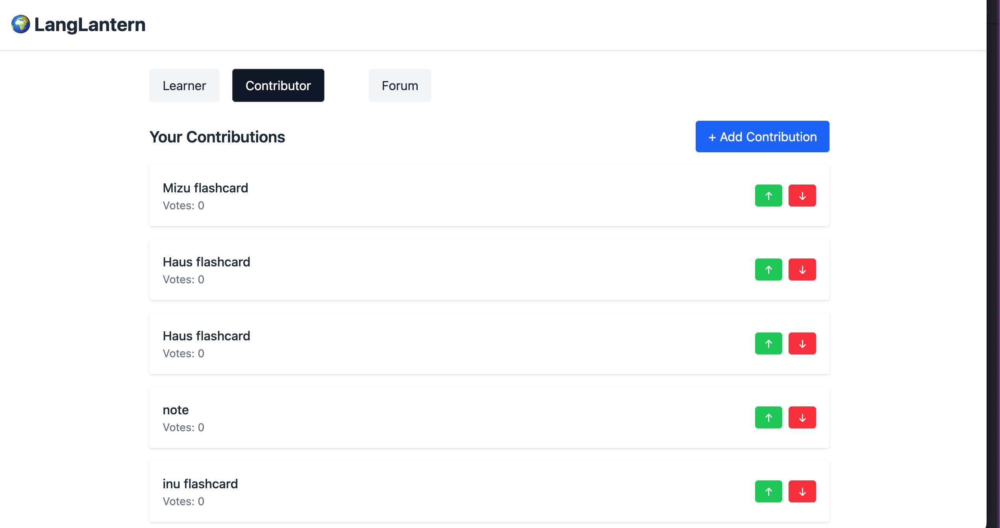
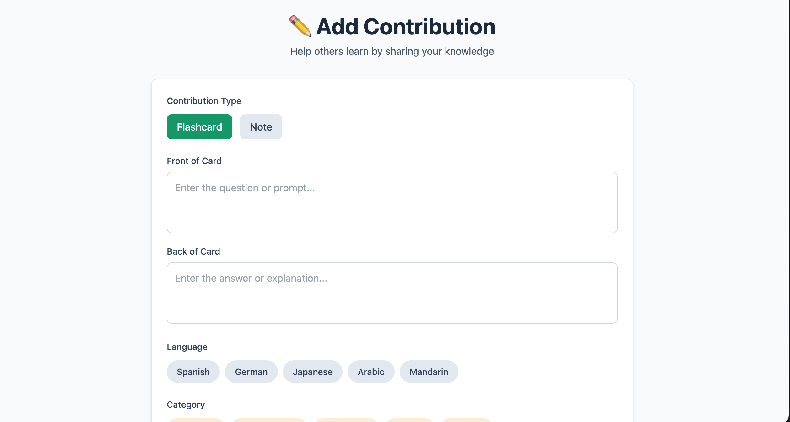
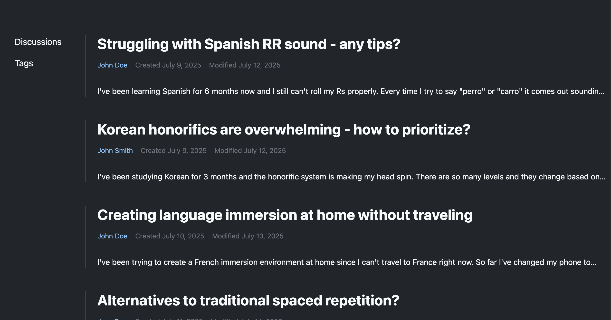
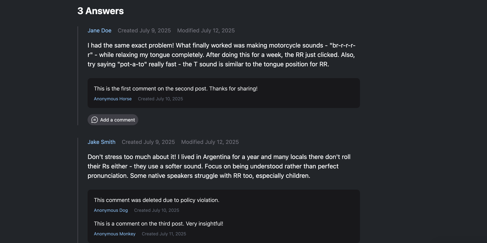

# LangLantern

A collaborative language learning platform that combines crowdsourced contributions with structured guided learning experiences. LangLantern empowers users to both learn from and contribute to a growing collection of uncommon language and dialect courses, lessons, and learning materials.

## Features

- **Crowdsourced Content**: Community-driven contributions of language learning materials
- **Guided Learning**: Structured courses and learning paths
- **Interactive Lessons**: Engaging learning experiences
- **Community-Powered**: Learn from and contribute to the global language learning community

## Screenshots

### Dashboard


### Learning Content


### Contribution Flow
| Review Contributions | Add Contribution |
|---|---|
|  |  |

### Forum
| Forum Overview | Discussion Thread |
|---|---|
|  |  |

## Project Structure

```
rose-token/
├── api/           # Backend API server
├── web/           # Frontend web application
├── docs/          # Documentation and images
```

## Prerequisites

Before running LangLantern, make sure you have the following installed:

- [Node.js](https://nodejs.org/) (v16 or higher)
- [pnpm](https://pnpm.io/) package manager
- [MongoDB](https://www.mongodb.com/) (local installation or Atlas cloud database)

## Setup Instructions

### 1. Clone the Repository

```bash
git clone <repository-url>
cd rose-token
```

### 2. Database Configuration

Create a `.env` file in the `api/prisma` folder:

```bash
# Navigate to the prisma folder
cd api/prisma

# Create the environment file
touch .env
```

Add your MongoDB connection string to the `.env` file:

```env
# For local MongoDB
DATABASE_URL="mongodb://localhost:27017/langlantern"

# OR for MongoDB Atlas (replace with your connection string)
DATABASE_URL="mongodb+srv://<username>:<password>@<cluster>.mongodb.net/langlantern?retryWrites=true&w=majority"
```

**Note**: Replace `<username>`, `<password>`, and `<cluster>` with your actual MongoDB Atlas credentials if using cloud database. Also make sure to include the name of database (you can use any name) e.g. /langlantern in above url

### 3. Install Dependencies

Install dependencies for both the API and web applications:

```bash
# Install API dependencies
cd api
pnpm install

# Install web dependencies
cd web
pnpm install
```

### 4. Database Setup

```bash
# Navigate back to the API folder
cd /api

# Generate schema
npx prisma generate
```

### 5. Start the Development Servers

You'll need to run both the API and web servers. Open two terminal windows:

**Terminal 1 - API Server:**
```bash
cd api
pnpm dev
```

**Terminal 2 - Web Server:**
```bash
cd web
pnpm dev
```

### 6. Access the Application

Once both servers are running:

1. Open your browser
2. Navigate to the frontend URL (as shown in the web terminal)
3. The API will be running on its own port (as configured)

## Development Workflow

1. **API Development**: Make changes in the `api/` folder
2. **Frontend Development**: Make changes in the `web/` folder
3. **Database Changes**: Update Prisma schema and run migrations as needed
4. **Documentation**: Update relevant docs and add screenshots to `docs/images/`

## Contributing

We welcome contributions to LangLantern! Please read our contributing guidelines and submit pull requests for any improvements.
